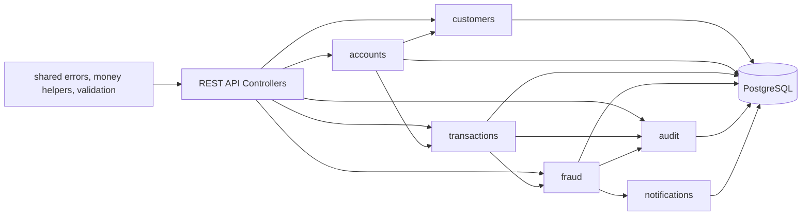

# m1-banklab

`m1-banklab` is a professional Java/Spring Boot banking systems lab for demonstrating backend engineering skills relevant to banking, fintech, fraud, payments, and enterprise systems.

This is not a fake banking app UI. It is a backend systems lab for learning and demonstrating Java banking infrastructure: account ledgers, transaction validation, fraud rules, auditability, and future event-driven architecture.

## What It Demonstrates

- Modular monolith architecture that can later split into services.
- Customer and account lifecycle APIs.
- Deposit, withdrawal, and transfer workflows.
- PostgreSQL persistence with Flyway migrations.
- Auditable financial actions.
- Basic fraud risk scoring.
- Request validation and clean error responses.
- OpenAPI/Swagger API documentation.
- Dockerized local development.
- JUnit 5 and Testcontainers integration tests.
- GitHub Actions CI.

## Screenshots

Add screenshots after running locally:

- `docs/screenshots/swagger-ui.png` - Swagger UI API docs.
- `docs/screenshots/postman-transfer.png` - Transfer request example.
- `docs/screenshots/fraud-assessments.png` - Fraud assessment response.
- `docs/screenshots/audit-events.png` - Audit event response.

## Tech Stack

- Java 21
- Spring Boot 3
- Maven
- PostgreSQL
- Spring Web
- Spring Data JPA
- Spring Validation
- Spring Security starter with permissive MVP config
- Flyway
- springdoc-openapi / Swagger UI
- Docker Compose
- JUnit 5
- Testcontainers
- GitHub Actions

## Architecture



Package layout:

```text
com.m1banklab
├── identity
├── customers
├── accounts
├── transactions
├── fraud
├── loans
├── audit
├── notifications
└── shared
```

`identity` and `loans` are intentionally present as module placeholders. The MVP keeps authentication simple and leaves loan origination/servicing for the roadmap.

## API Routes

| Method | Route | Purpose |
| --- | --- | --- |
| `POST` | `/api/customers` | Create customer |
| `GET` | `/api/customers/{id}` | Get customer |
| `POST` | `/api/accounts` | Create checking/savings account |
| `GET` | `/api/accounts/{id}` | Get account |
| `POST` | `/api/accounts/{id}/deposit` | Deposit funds |
| `POST` | `/api/accounts/{id}/withdraw` | Withdraw funds |
| `POST` | `/api/transfers` | Transfer between accounts |
| `GET` | `/api/accounts/{id}/transactions` | List account transactions |
| `GET` | `/api/fraud/assessments` | List fraud assessments |
| `GET` | `/api/audit/events` | List audit events |

Swagger UI:

```text
http://localhost:8080/swagger-ui.html
```

## Local Setup

Prerequisites:

- Java 21
- Maven
- Docker Desktop

Start PostgreSQL:

```sh
cp .env.example .env
docker compose up -d
```

Run tests:

```sh
mvn test
```

Run the app:

```sh
mvn spring-boot:run
```

Open Swagger:

```text
http://localhost:8080/swagger-ui.html
```

Stop local infrastructure:

```sh
docker compose down
```

## API Examples

Create a customer:

```sh
curl -X POST http://localhost:8080/api/customers \
  -H "Content-Type: application/json" \
  -d '{
    "firstName": "Maya",
    "lastName": "Chen",
    "email": "maya.chen@example.com",
    "phone": "+1-336-555-1212"
  }'
```

Create an account:

```sh
curl -X POST http://localhost:8080/api/accounts \
  -H "Content-Type: application/json" \
  -d '{
    "customerId": "11111111-1111-1111-1111-111111111111",
    "type": "CHECKING",
    "openingBalance": "500.00"
  }'
```

Deposit:

```sh
curl -X POST http://localhost:8080/api/accounts/aaaaaaaa-aaaa-aaaa-aaaa-aaaaaaaaaaaa/deposit \
  -H "Content-Type: application/json" \
  -d '{
    "amount": "6000.00",
    "description": "payroll funding"
  }'
```

Withdraw:

```sh
curl -X POST http://localhost:8080/api/accounts/aaaaaaaa-aaaa-aaaa-aaaa-aaaaaaaaaaaa/withdraw \
  -H "Content-Type: application/json" \
  -d '{
    "amount": "125.00",
    "description": "atm withdrawal"
  }'
```

Transfer:

```sh
curl -X POST http://localhost:8080/api/transfers \
  -H "Content-Type: application/json" \
  -d '{
    "sourceAccountId": "aaaaaaaa-aaaa-aaaa-aaaa-aaaaaaaaaaaa",
    "targetAccountId": "cccccccc-cccc-cccc-cccc-cccccccccccc",
    "amount": "250.00",
    "description": "rent split"
  }'
```

View fraud assessments:

```sh
curl http://localhost:8080/api/fraud/assessments
```

View audit events:

```sh
curl http://localhost:8080/api/audit/events
```

## Fraud Rules

The MVP fraud engine is deterministic and explainable:

- Amount over `5000` = medium risk.
- Amount over `10000` = high risk.
- More than 3 transactions in 10 minutes = elevated risk.
- More than 6 transactions in 10 minutes = high velocity risk.
- Transfer to a new payee = medium risk.
- Failed withdrawal due to insufficient funds creates an audit event.

Each financial transaction gets a `fraud_assessments` row with a score, risk level, and reasons.

## Database

Flyway migrations create:

- `customers`
- `accounts`
- `transactions`
- `fraud_assessments`
- `audit_events`
- `notifications`

Seed data includes two customers, three accounts, and an initial audit event.

## Why This Matters For Banking Engineering

Banking backends are less about flashy screens and more about correctness under constraints:

- Money movement must be validated and traceable.
- Account balances need consistent transaction boundaries.
- Fraud decisions must be explainable.
- Every important action needs an audit trail.
- Systems should be modular before they become distributed.

`m1-banklab` is designed to show those concerns directly in code.

## Roadmap

- Idempotency keys for deposits, withdrawals, and transfers.
- Double-entry ledger with journal entries.
- Authentication and role-based authorization.
- Account holds and pending transactions.
- ACH-style payment batches.
- Event outbox table and async notification worker.
- Loan origination and underwriting module.
- More advanced fraud rules and case management.
- Observability with structured logs, metrics, and tracing.
- Contract tests and OpenAPI-generated clients.

## License

MIT
