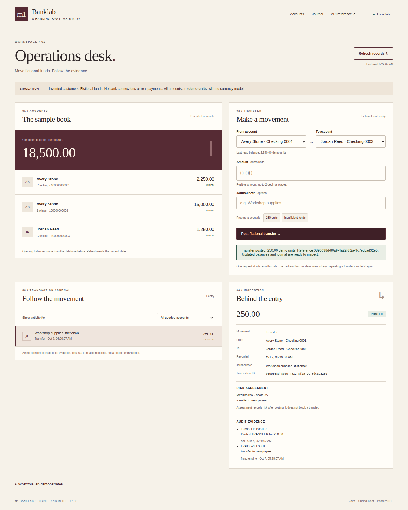

# m1-banklab

`m1-banklab` is a synthetic Java/Spring Boot banking systems lab with an operations desk that makes backend behavior visible: move fictional funds, inspect account balances, and follow a transaction through its journal, risk assessment, and audit evidence.

It uses invented customers and balances to teach backend engineering. It does not connect to banks, move real money, implement regulatory compliance, or provide production authentication. Keep it on localhost and use synthetic data only. Account balance records are not a double-entry ledger.



[Mobile view and screenshot provenance](docs/screenshots/README.md)

## What It Demonstrates

- A responsive, keyboard-accessible operations desk served directly by Spring.
- Real account reads and transfers through same-origin APIs; no frontend build required.
- Modular monolith architecture that can later split into services.
- Customer and account lifecycle APIs.
- Deposit, withdrawal, and transfer workflows.
- PostgreSQL persistence with Flyway migrations.
- Auditable financial actions.
- Basic fraud risk scoring.
- Request validation and clean error responses.
- OpenAPI/Swagger API documentation.
- Dockerized local development.
- JUnit 5 and Testcontainers integration tests.
- GitHub Actions CI.
- Browser → Spring → PostgreSQL tests with direct database assertions and screenshots.

## Tech Stack

- Java 21
- Spring Boot 3
- Maven
- PostgreSQL
- Spring Web
- Spring Data JPA
- Spring Validation
- Spring Security starter with permissive MVP config
- Flyway
- springdoc-openapi / Swagger UI
- Docker Compose
- JUnit 5
- Testcontainers
- GitHub Actions
- Plain HTML/CSS/JavaScript; Playwright and axe for development tests

## Documentation

- [Technical manual](docs/technical-manual.md)
- [Product story and demo](docs/product-story.md)
- [Architecture](docs/architecture.md)
- [Roadmap](docs/roadmap.md)
- [API Examples](docs/api-examples.md)
- [Banking Domain Notes](docs/banking-domain-notes.md)
- [Local Development](docs/local-development.md)
- [Testing Strategy](docs/testing.md)

## API Routes

| Method | Route | Purpose |
| --- | --- | --- |
| `POST` | `/api/customers` | Create customer |
| `GET` | `/api/customers/{id}` | Get customer |
| `POST` | `/api/accounts` | Create checking/savings account |
| `GET` | `/api/accounts/{id}` | Get account |
| `POST` | `/api/accounts/{id}/deposit` | Deposit funds |
| `POST` | `/api/accounts/{id}/withdraw` | Withdraw funds |
| `POST` | `/api/transfers` | Transfer between accounts |
| `GET` | `/api/accounts/{id}/transactions` | List account transactions |
| `GET` | `/api/fraud/assessments` | List fraud assessments |
| `GET` | `/api/audit/events` | List audit events |

Swagger UI:

```text
http://localhost:8080/swagger-ui.html
```

## Quick Start

Prerequisites:

- Java 21
- Maven
- Docker Desktop

Run locally:

```sh
cp .env.example .env
docker compose up -d
mvn test
mvn spring-boot:run
```

Open the operations desk:

```text
http://localhost:8080/
```

Select Avery's checking account and Jordan's checking account, enter `250.00`, and post a fictional transfer. On a fresh database their balances change from `2500.00` / `1000.00` to `2250.00` / `1250.00`. Select the journal entry to inspect its server-generated transaction ID, fraud assessment, and audit events. **Insufficient funds** prepares an amount above the last read balance; it sends nothing until you submit. The backend evaluates that request and returns 422 if funds are insufficient.

The desk uses only the three seeded accounts. Swagger at `/swagger-ui.html` covers the remaining customer, deposit, and withdrawal APIs. The UI disables overlapping submissions, but the backend has **no idempotency keys**. After an uncertain response, inspect the records before deciding on any new transfer.

Node is only required for frontend tests, not to run the application. With a disposable Compose database and a built JAR, run `npm ci`, `npm test`, `npx playwright install chromium`, and `npm run test:browser`. See [Testing Strategy](docs/testing.md) for database settings and the exact checks.

Stop local infrastructure:

```sh
docker compose down
```

If port `5432` is already occupied:

```sh
POSTGRES_PORT=55432 docker compose up -d
SPRING_DATASOURCE_URL=jdbc:postgresql://localhost:55432/m1_banklab mvn spring-boot:run
```

## Why This Matters

The operations desk gives reviewers a direct way to inspect correctness under constraints:

- Money movement must be validated and traceable.
- Account balances need consistent transaction boundaries.
- Fraud decisions must be explainable.
- Every important action needs an audit trail.
- Systems should be modular before they become distributed.

`m1-banklab` connects the visible workflow to those decisions in code. The [technical manual](docs/technical-manual.md) walks through the frontend state, APIs, database transactions, failure labs, and exercises with answers. The [product story](docs/product-story.md) explains the fictional training scenario and who benefits from it.

## License

MIT
