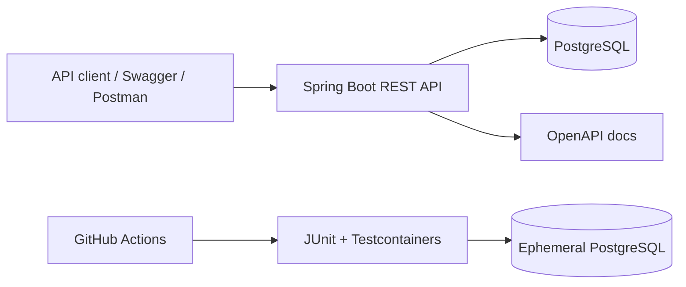
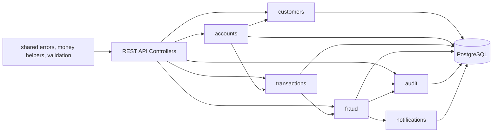
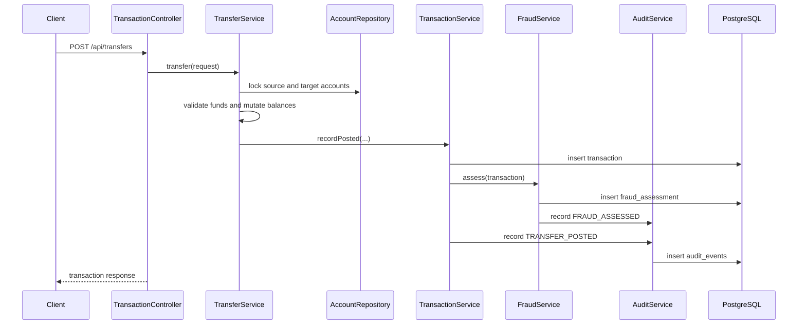

# Architecture

`m1-banklab` starts as a modular monolith. The goal is to keep deployment simple while making domain boundaries explicit enough that modules can later split into services.

## System Context



## Module Map



## Package Layout

```text
com.m1banklab
├── identity
├── customers
├── accounts
├── transactions
├── fraud
├── loans
├── audit
├── notifications
└── shared
```

## Boundary Notes

- `customers` owns customer identity/profile data.
- `accounts` owns account state and balance mutation.
- `transactions` owns financial movement records and transfer orchestration.
- `fraud` owns deterministic risk scoring and fraud assessment persistence.
- `audit` owns append-style audit events.
- `notifications` owns outbound notification records.
- `identity` is reserved for future authentication and authorization.
- `loans` is reserved for future origination, underwriting, servicing, and delinquency workflows.
- `shared` contains cross-cutting API errors and money helpers.

## Request Flow

Typical transfer flow:



## Design Constraints

- Controllers stay thin.
- Services own business logic.
- DTOs define API boundaries.
- JPA entities model persistence state.
- Flyway owns schema changes.
- `BigDecimal` is used for money.
- Account writes use pessimistic locking for balance mutation.
- Every financial action should produce an audit trail.
